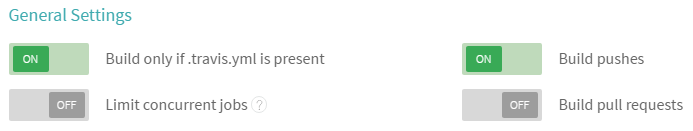
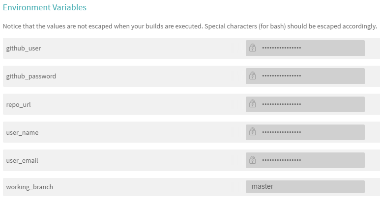

## Deploy Jekyll pages using Git and Travis CI

I just cloned from [Felix Rieseberg's](https://github.com/felixrieseberg/travis-jekyll-git) repo and did some modification based on my situation, you may check it out my branch `myVersion` here, Thanks for Felix's sharing!

GitHub Pages are an amazing way to host Jekyll pages, but in some cases, you might be interested in running your Jekyll page on a different host (like Azure Web Apps, Heroku, AWS). Since the magic of Jekyll is that it generates static websites, I did not want to run a full Ruby server. Instead, I'm using Travis CI to setup a devops build pipeline, taking new commits, testing the page, and deploying it. Here's the workflow:

 * Create a new commit, triggering Travis CI
 * Install Ruby, Jekyll, HTMLProofer, and all dependencies
 * Compile the page
 * Test that all images and links work (using HTMLProofer)
 * If the test passed, enter the generated `_site` directory and create a new empty Git repository
 * Add and commit all static files
 * Force-push the result to a desired remote Git repo, suppressing any potentially compromising log messages

The files of interest here are `.travis.yml`, <strike>`_config_ci.yml`</strike>(I didn't used this config in my project, as I just need to add `exclude: [vendor]` in my `_config.yml`, which is easier for me.[[reference](https://jekyllrb.com/docs/continuous-integration/)]), `scripts/build.sh` and `scripts/deploy.sh`. The Travis configuration file instructs Travis, to build, test, and deploy using <strike>`_config_ci.yml` as Jekyll configuration and</strike> `scripts/deploy.sh` as the custom deployment provider.

<strike>To use this for your own project, update `.travis.yml` with your own white and blacklisted branches. Then, check `build.sh` and ensure that the settings for `jekyll build` and HTMLProofer are fit for your site (in most cases, they should be).</strike>As I only need Travis CI trigered when I build pushes, so here I make my Travis CI's `General Settings` like this: 

<strike>Finally, go to your Travis Profile to edit the settings for your source repository. In there, add three environment variables:

* `git_user` Git username
* `git_password` Git password
* `git_target` Git target repository url (without `https://`)</strike>

I used six environment variables here in my Travis CI Settings, and keep the `Display value in build log` this way:

Note: `repo_url` is the url address of your repo like this `github.com/JasonTian/travis-jekyll-git.git`, make sure don't include `https://`, `working_branch` means the branch that your Travis CI is working on.

Include the related files here and put them in your source repo - and you're good to go!

## License
MIT, please see LICENSE for details. 
